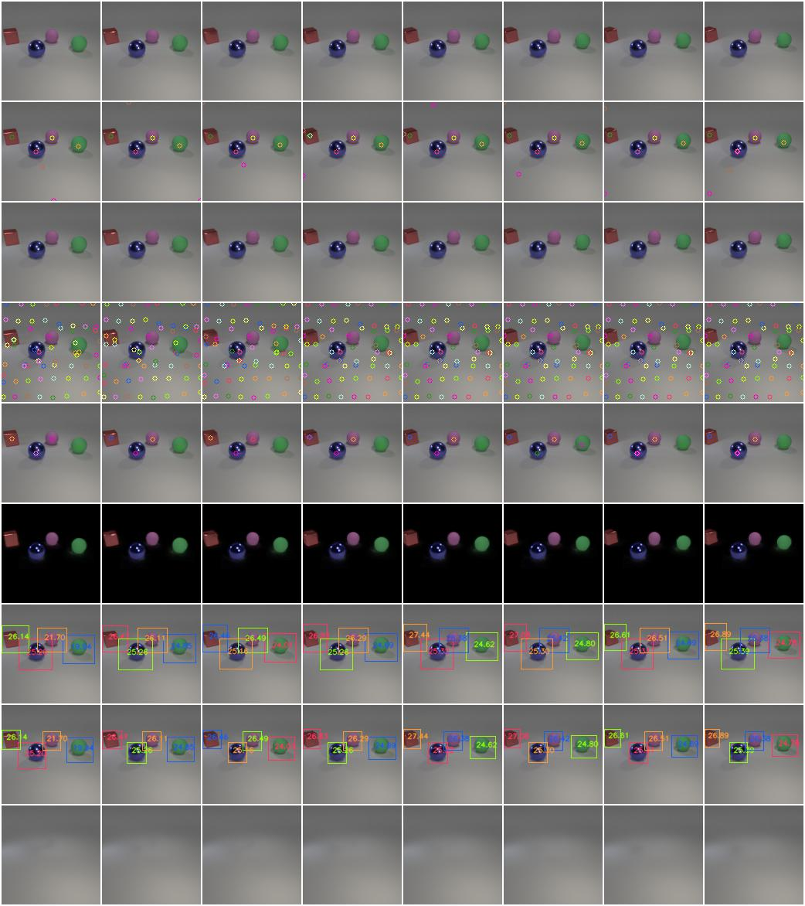
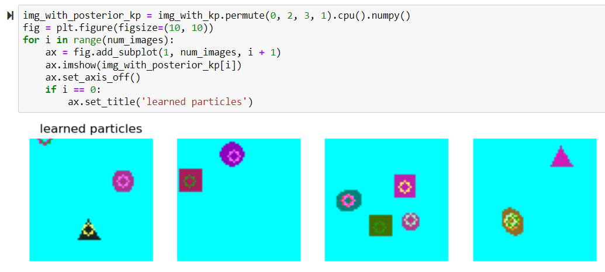

# ddlp-pytorch

Official PyTorch implementation of the paper "DDLP: Unsupervised Object-centric Video Prediction with Deep Dynamic Latent
Particles".


<h1 align="center">
  <br>
	DDLP: Unsupervised Object-centric Video Prediction with<br> Deep Dynamic Latent Particles
  <br>
</h1>
  <h3 align="center">
    <a href="https://taldatech.github.io">Tal Daniel</a> •
    <a href="https://avivt.github.io/avivt/">Aviv Tamar</a>

  </h3>
<h3 align="center">Official repository of DLPv2, DDLP and DiffuseDDLP</h3>

<h4 align="center"><a href="https://taldatech.github.io/ddlp-web">Project Website</a> • <a href="">Video</a></h4>

<h4 align="center">
    <a href="https://colab.research.google.com/github/taldatech/ddlp"></a>
</h4>


<p align="center">
  
</p>
<p align="center">
  
  
</p>
<p align="center">
  
  
</p>

# DDLP: Unsupervised Object-centric Video Prediction with Deep Dynamic Latent Particles

> **DDLP: Unsupervised Object-centric Video Prediction with Deep Dynamic Latent Particles**<br>
> Tal Daniel, Aviv Tamar<br>
>
> **Abstract:** *We propose a new object-centric video prediction algorithm based on the deep latent particle (DLP) representation.
> In comparison to existing slot- or patch-based representations, DLPs model the scene using a set of keypoints
> with learned parameters for properties such as position and size, and are both efficient and interpretable.
> Our method, deep dynamic latent particles (DDLP), yields state-of-the-art object-centric video prediction results
> on several challenging datasets. The interpretable nature of DDLP allows us to perform
> ``what-if'' generation -- predict the consequence of changing properties of objects in the initial frames,
> and DLP's compact structure enables efficient diffusion-based unconditional video generation.*

## Citation

Daniel, Tal, and Aviv Tamar. "DDLP: Unsupervised Object-centric Video Prediction with Deep Dynamic Latent Particles." arXiv
preprint arXiv:2306.05957 (2023).

    @article{daniel23ddlp,
    author    = {Daniel, Tal and Tamar, Aviv},
    title     = {DDLP: Unsupervised Object-centric Video Prediction with Deep Dynamic Latent Particles},
    journal = {arXiv preprint arXiv:2306.05957},
    year      = {2023}
    }


<h4 align="center">Preprint on ArXiv: <a href="https://arxiv.org/abs/2306.05957">2306.05957</a></h4>

- [ddlp-pytorch](#ddlp-pytorch)
- [Deep Dynamic Latent Particles](#deep-dynamic-latent-particles)
  * [Citation](#citation)
  * [Updates](#updates)
  * [Prerequisites](#prerequisites)
  * [Model Zoo - Pretrained Models](#model-zoo---pretrained-models)
  * [Interactive Graphical User Interface (GUI)](#interactive-graphical-user-interface--gui-)
  * [Datasets](#datasets)
  * [DLPv2 and DDLP - Training](#dlpv2-and-ddlp---training)
  * [DDLP - Evaluation](#ddlp---evaluation)
  * [DDLP - Video Prediction with Pre-trained Models](#ddlp---video-prediction-with-pre-trained-models)
  * [DiffuseDDLP - Training](#diffuseddlp---training)
  * [DiffuseDDLP - Video Generation with Pre-trained Models](#diffuseddlp---video-generation-with-pre-trained-models)
  * [Documentation and Notebooks](#documentation-and-notebooks)
  * [Repository Organization](#repository-organization)

## Updates
* 28.09.23  - Initial code release, interactive GUI will come later.
* 08.06.23 - Code coming soon!

## Prerequisites

* For your convenience, we provide an `environemnt.yml` file which installs the required packages in a `conda`
  environment named `torch`. Alternatively, you can use `pip` to install `requirements.txt`.
    * Use the terminal or an Anaconda Prompt and run the following command `conda env create -f environment.yml`.

| Library           | Version          | Why??? |
|-------------------|------------------| -------|
| `Python`          | `3.7-8 (Anaconda)` | - |
| `torch`           | > = `1.13.0`       | - |
| `torchvision`     | > = `0.13`         | -|
| `matplotlib`      | > = `3.7.1`       | - |
| `numpy`           | > = `1.24.3`        | - |
| `h5py`           | > = `3.1.0`        | Required ro read the "Balls-Interaction" dataset|
| `py-opencv`       | > = `3.4.2`       | For plotting |
| `tqdm`            | > = `4.65.0`      | - |
| `scipy`           | > = `1.8.1`       | - |
| `scikit-image`    | > = `0.19.2`      | Required to generate the "Shapes" dataset|
| `ffmpeg`    | = `4.2.2`      | Required to generate video files|
| `accelerate`      | > = `0.19.0`       | For multi-GPU training |
| `imageio`      | > = `2.6.1`       | For creating video GIFs |
| `piqa`      | > = `1.3.1`       | For image evaluation metrics: LPIPS, SSIM, PSNR |
| `notebook`      | > = `6.5.4`       | To run Jupyter Notebooks |
|`einops`           |      > = `0.5.0`              | Required for diffusion modules from <a href="https://github.com/lucidrains/denoising-diffusion-pytorch">lucidrains repository </a> |
|`tkinter`          |    > = `8.6`               | GUI |
|`ttkthemes`          |    > = `3.2.2`               | GUI |
|`ttkwidgets`          |    > = `0.13.0`               | GUI |

For a manual installation guide, see `docs/installation.md`.

## Model Zoo - Pretrained Models

* We provide pre-trained checkpoints for the 3 datasets we used in the paper.
* All model checkpoints should be placed inside the `/checkpoints` directory.
* The interactive GUI will use these checkpoints.

| Model Type           | Dataset                          | Link                                                                                |
|-------------------|------------------------------------|-------------------------------------------------------------------------------------|
|--|**DLPv2 - Single-image Object-centric Image Decomposition Model**|--|
| DLPv2  | OBJ3D (128x128) | [MEGA.nz](https://mega.nz/file/wdMUxaQJ#75L0jqofo4Gj1EyjIJN2zBzt6XFN9s2jgU83XjjAqXQ)|
| DLPv2 | Traffic (128x128) | [MEGA.nz](https://mega.nz/file/MNljnLCZ#3d6U6zP_FCDOBpxPWOJdOOnmjiq8Cyl9ND2u8qjXlsE)|
|--|**DDLP - Conditional Video Decomposition and Prediction Model**|--|
| DDLP  | OBJ3D (128x128) | [MEGA.nz](https://mega.nz/file/QcsRSQRD#-jCBXhIIKs__6Zys8eBLo8f75WQfDhP0LcPLuRgy5p8)|
| DDLP  | Traffic (128x128) | [MEGA.nz](https://mega.nz/file/9clHVLTI#6_HQXzHWLYal36HnNnynqzQwnmzVY4FIXbnVmQ5eXa8)|
| DDLP  | PHYRE (128x128) | [MEGA.nz](https://mega.nz/file/UBcl2LgQ#cA2mS1mfSoAbNa8VmjeSkrRHDlXlupjVNNXnhO8zoPs)|
| DDLP | CLEVRER (128x128) | [MEGA.nz](https://mega.nz/file/oUUjXY4B#LLxCs1h3h3v4pXbLjl2Tplxwoq41DWaLJxyRHTgOWnw)|
|--|**DiffuseDDLP - Unconditional Video Generation Model**|--|
| DiffuseDDLP  | OBJ3D (128x128) | [MEGA.nz](https://mega.nz/file/kJkgAa6a#owpT2vTvPWLEG5KRh-JqZXt3yL1Y1wSH7R3lyZT9uRs)|
| DiffuseDDLP | Traffic (128x128) | [MEGA.nz](https://mega.nz/file/4J0DHBBA#EwETJSsL_Utzn8L7GBL9E63MNolKKqEgBd40HCBnoac)|

## Interactive Graphical User Interface (GUI)

* We designed a `tkinter`-based interactive GUI to plot and modify the particles, and generate videos from latent modifications.
* The demo is a **standalone and does not require to download the original datasets**.
* We provide example images under`/assets/` which will be used for the GUI.

To run the GUI (after downloading the checkpoints): `python interactive_gui.py`

The `checkpoints` directory should look like:

```
checkpoints
├── ddlp-obj3d128
│   ├── obj3d128_ddlp.pth
│   ├── hparams.json
├── dlp-traffic
├── diffuse-ddlp-obj3d128
│   ├── diffusion_hparams.json
│   ├── ddlp_hparams.json
│   ├── latent_stats.pth
│   ├── saves
│   │   ├── model.pth
└── ...
```
The GUI enables interacting with the particles and the resulting effect on the image or video.

For more usage instructions, see `/docs/gui.md`.


## Datasets

| Dataset           | Notes                         | Link                                                                                |
|-------------------|------------------------------------|--------------------------------------------------------------------------------------|
| OBJ3D  | Courtesy of [G-SWM](https://github.com/zhixuan-lin/G-SWM) | [Google Drive](https://drive.google.com/file/d/1XSLW3qBtcxxvV-5oiRruVTlDlQ_Yatzm/view)|
| Traffic | Courtesy of [Ron Mokady](https://rmokady.github.io/)  | [MEGA.nz](https://mega.nz/file/8VFCGZza#R6ypaEtuZ-rXL2P8IpzVsBOqqiduqZXbZ1BGiyCjpE8)|
| PHYRE  | See `datasets/phyre_preparation.py` to generate new data or download the data we generated | [MEGA.nz](https://mega.nz/file/lIkDnZZD#Ym4vlAqd3egCljoujya33KHaua7AwmusmbUw27OdIHE)|
| CLEVRER  | We use episodes 0-4999 from the training videos for training, 0-999 for validation and 1000-1999 for test from the validation videos  | [Homepage](http://clevrer.csail.mit.edu/), [Training Videos](http://data.csail.mit.edu/clevrer/videos/train/video_train.zip), [Validation Videos](http://data.csail.mit.edu/clevrer/videos/validation/video_validation.zip)|
| Balls-Interaction  | Synthetic, courtesy of [G-SWM](https://github.com/zhixuan-lin/G-SWM), see [this link](https://github.com/zhixuan-lin/G-SWM/blob/master/scripts/gen_data_balls.sh) to generate or download data we generated | [MEGA.nz](https://mega.nz/file/4cUR1b5a#RwFFzCiESeeQb8rYgt7PK2_D8b_69-K85RV3jlaphTo)|
| Shapes  | Synthetic, generated on-the-fly | see `generate_shape_dataset_torch()` in `datasets/shapes_ds.py`|
| Custom Dataset  | 1. Implement a `Dataset` (see examples in `/datasets`).<br>2. Add it to `get_image_dataset()` and `get_video_dataset()` in `/datasets/get_dataset.py`.<br> 3. Prepare a `json` config file with the hyperparameters and place it in`/configs`.| -|


## DLPv2 and DDLP - Training 

You can train the models on single-GPU machines and multi-GPU machines. For multi-GPU training We use
[HuggingFace Accelerate](https://huggingface.co/docs/accelerate/index): `pip install accelerate`.

1. Set visible GPUs under: `os.environ["CUDA_VISIBLE_DEVICES"] = "0, 1, 2, 3"` (`NUM_GPUS=4`)
2. Set "num_processes": NUM_GPUS in `accel_conf.yml` (e.g. `"num_processes":4`
   if `os.environ["CUDA_VISIBLE_DEVICES"] = "0, 1, 2, 3"`).


* Single-GPU machines: `python train_dlp.py -d {dataset}` / `python train_ddlp.py -d {dataset}`
* Multi-GPU machines: `accelerate --config_file ./accel_conf.yml train_dlp_accelerate.py -d {dataset}` / `accelerate --config_file ./accel_conf.yml train_ddlp_accelerate.py -d {dataset}`

Config files for the datasets are located in `/configs/{ds_name}.json`. You can modify hyperparameters in these files.
To generate a config file for a new datasets you can copy one of the files in `/confgis` or use the `/configs/generate_config_file.py` script.

**Hyperparameters**: See `/docs/hyperparamters.md` for extended details and recommended values.

The scripts `train_dlp.py`/`train_ddlp.py` or `train_dlp_accelerate.py`/`train_ddlp_accelerate.py` are using the config file `/configs/{ds_name}.json`

Examples:

* Single-GPU:

*DLPv2*:

`python train_dlp.py --dataset shapes`

`python train_dlp.py --dataset traffic_img`

*DDLP*:

`python train_ddlp.py --dataset obj3d128`

`python train_ddlp.py --dataset phyre`

* Multi-GPU:

*DLPv2*:

`accelerate --config_file ./accel_conf.yml train_dlp_accelerate.py --dataset traffic_img`

*DDLP*:

`accelerate --config_file ./accel_conf.yml train_ddlp_accelerate.py --dataset obj3d128`


* Note: if you want multiple multi-GPU runs, each run should have a different accelerate config file (
  e.g., `accel_conf.yml`, `accel_conf_2.yml`, etc..). The only difference between the files should be
  the `main_process_port` field (e.g., for the second config file, set `main_process_port: 81231`).

* During training, the script saves (locally) a log file with the metrics output and images in the following structure:

<p align="center">
  
</p>

where the columns are different images in the batch (DLPv2) or an image sequence (DDLP) and the rows correspond to:

| Row | Image Meaning                                                           |
|-----|-------------------------------------------------------------------------|
| 1   | Ground-truth (GT) original input image                                  |
| 2   | GT image + *all* `K` posterior particles                                |
| 3   | Reconstruction of the entire scene                                      |
| 4   | GT image + *all* prior keypoints (proposals)                            |
| 5   | GT image + top-`K` posterior particle filtered by their uncertainty     |
| 6   | Foreground reconstruction (decoded glimpses and masks of the particles) |
| 7   | GT image + bounding boxes based on the scale attribute `z_s`            |
| 8   | GT image + bounding boxes based on the decoded particles masks          |
| 9   | Backgroung reconstruction                                               |


## DDLP - Evaluation

The evaluation protocol measures the reconstruction quality via 3 metrics: LPIPS, SSIM and PSNR.

We use the open-source `piqa` (`pip install piqa`) to compute the metrics. If `eval_im_metrics=True` in the config file,
the metrics will be computed every evaluation epoch on the *validation* set. The code saves the best model based
on the LPIPS metric.

To evaluate a pre-trained DDLP model (on the *test* set) on video prediction, we provide a script:

`python eval/eval_gen_metrics.py --help`

For example, to evaluate a model saved in `/310822_141959_obj3d128_ddlp` on the test set, with 6 conditional frames and a
generation horizon of 50 frames:

`python eval/eval_gen_metrics.py -d obj3d128 -p ./310822_141959_obj3d128 -c 6 --horizon 50`

The script will load the config file `hparams.json` from `/310822_141959_obj3d128_ddlp/hparams.json` and the model
checkpoint from `/310822_141959_obj3d128_ddlp/saves/obj3d128_ddlp_best_lpips.pth` and use it to generate video predictions.

Alternatively, you can specify a direct path to the checkpoint as follows:

`python eval/eval_gen_metrics.py -d obj3d128 -p ./checkpoints/ddlp-obj3d128 -c 6 --horizon 50 --checkpoint ./checkpoints/ddlp-obj3d128/obj3d128_ddlp.pth`

For more options, see `python eval/eval_gen_metrics.py --help`.

For a similar evaluation of DLPv2 in the single-image setting, see `eval_dlp_im_metric()` in `/eval/eval_gen_metrics.py`.

## DDLP - Video Prediction with Pre-trained Models

To generate a video prediction using a pre-trained model use `generate_ddlp_video_prediction.py` as follows:

`python generate_ddlp_video_prediciton.py -d obj3d128 -p ./310822_141959_obj3d128_ddlp -n 1 -c 10 --horizon 100`

The script will load the config file `hparams.json` from `/310822_141959_obj3d128_ddlp/hparams.json` and the model
checkpoint from `/310822_141959_obj3d128_ddlp/saves/obj3d128_ddlp_best_lpips.pth` and use it to generate `n` video predictions,
based on 10 conditional input frames, and a final video length of 100 frames. In the example above, a single (`n=1`) video
will be generated and saved within an `animations` directory (will be created if it doesn't exist) under the checkpoint directory.

Alternatively, you can specify a direct path to the checkpoint as follows:

`python generate_ddlp_video_prediciton.py -d obj3d128 -p ./checkpoints/ddlp-obj3d128 -n 1 -c 10 --horizon 100 --checkpoint ./checkpoints/ddlp-obj3d128/obj3d128_ddlp.pth`

For more options, see `python generate_ddlp_video_prediction.py --help`.

##  DiffuseDDLP - Training

DiffuseDDLP is an unconditional object-centric video generation model that models the distribution of latent particles
representing the first few frames of a video. To do so, it assumes access to a pre-trained DDLP model. For a stable
training of the diffusion, the particles should be normalized, and thus, before the DDPM training we need to calculate
the latent particles' statistics (min/max/mean/std). This is done automatically on the first run of the training script,
and saved as `latents_stats.pth` file for future usage.

The DDPM training is mostly based on [lucidrains' diffusion models repository](https://github.com/lucidrains/denoising-diffusion-pytorch), so if you are familiar with it, our code
maintains most of its functionality.

To train DiffuseDDLP, modify the config file `/configs/diffuse_ddlp.json` with:
* The number of conditional frames to learn (`diffuse_frames`, default is 4).
* The type of latent normalization (`particle_norm`, default is `minmax` in the (-1, 1) range). Choose between `minmax` and `std` (standardization).
* The path for the pre-trained DDLP directory `ddlp_dir` containing `hparams.json`.
* The path for the pre-trained DDLP checkpoint `ddlp_ckpt` file (`.pth`).

The training script will create a new results directory to save checkpoints and figures. 
Alternatively, if you want to continue training from a checkpoint, specify `result_dir` in the config file.

To run the training script:

`python train_diffuse_ddlp.py -c diffuse_ddlp.json`

## DiffuseDDLP - Video Generation with Pre-trained Models

To generate new videos from a pre-trained DiffuseDDLP model, you should use `generate_diffuse_ddlp_video_generation.py` as follows:

`python generate_diffuse_ddlp_video_generation.py -c ./checkpoints/diffuse-ddlp-obj3d128/diffusion_hparams.json -b 5 -n 10`

where `-c` points to the diffusion config file *inside* the "results" directory created when training DiffuseDDLP.
`-b` is the batch size and `-n` is the number of videos to generate.

Alternatively, you can generate plots of the generated frames instead of videos by specifying:

`python generate_diffuse_ddlp_video_generation.py -c ./checkpoints/diffuse-ddlp-obj3d128/diffusion_hparams.json -b 5 -n 10 --image`

For more options, see `python generate_diffuse_ddlp_video_generation.py --help`.

## Documentation and Notebooks

For your convenience, we provide more documentation in `/docs` and more examples of using the models in `/notebooks`.

| File                         | Content                                                                                                       |
|------------------------------|---------------------------------------------------------------------------------------------------------------|
| `docs/installation.md`       | Manual instructions to install packages with `conda`                                                          |
| `docs/gui.md`                | Instructions of using the GUI: loading models and examples, interacting with the particles                    |
| `docs/hyperparameters.md`    | Explanations of the various hyperparameters of the models and recommended values                              |
| `docs/example_usage.py`      | overview of the models functionality: forward output, loss calculation and sampling                           |
| `notebooks/dlpv2_ddlp_walkthrough_tutorial.ipynb` | tutorial and walkthrough of DLPv2 and DDLP, where we train and evaluate a DLPv2 model on the `shapes` dataset |
| `notebooks/ddlp_pretrained_loading_generation.ipynb` | tutorial and walkthrough of DDLP where we load a pre-trained DDLP model and generate and modify videos        |

<p align="center">
  
</p>

## Repository Organization

| File name                                            | Content                                                                                     |
|------------------------------------------------------|---------------------------------------------------------------------------------------------|
| `/checkpoints`                                       | directory for pre-trained checkpoints                                                       |
| `/assets`                                            | directory containing sample images for the interactive GUI                                  |
| `/datasets`                                          | directory containing data loading classes for the various datasets                          |
| `/configs`                                           | directory containing config files for the various datasets                                  |
| `/docs`                                              | various documentation files                                                                 |
| `/notebooks`                                         | various Jupyter Notebook examples of DLPv2 and DDLP                                         |
| `/eval/eval_model.py`                                | evaluation functions such as evaluating the ELBO                                            |
| `/eval/eval_gen_metrics.py`                          | evaluation functions for image metrics (LPIPS, PSNR, SSIM)                                  |
| `/modules/modules.py`                                | basic neural network blocks used to implement the (D)DLP model                              |
| `/modules/dynamic_modules.py`                        | basic neural network blocks used to implement the transformer-based dynamics module (PINT)  |
| `/modules/diffusion_modules.py`                      | basic neural network blocks used to implement the DiffuseDDLP model                         |
| `/utils/loss_functions.py`                           | loss functions used to optimize the model such as Chamfer-KL and perceptual (VGG) loss      |
| `/utils/util_func.py`                                | utility functions such as logging and plotting functions, Spatial Transformer Network (STN) |
| `models.py`                                          | implementation of DLPv2 and DDLP models                                                     |
| `train_dlp.py`/`train_ddlp.py`                       | training function of (D)DLP for single-GPU machines                                         |
| `train_dlp_accelerate.py`/`train_ddlp_accelerate.py` | training function of (D)DLP for multi-GPU machines                                          |
| `train_diffuse_ddlp.py`                              | training function of DifufseDDLP for single-GPU machines                                    | |
| `interactive_gui.py`                                 | `tkinter`-based interactive GUI to plot and interact with learned particles                 |
| `environment.yml`                                    | Anaconda environment file to install the required dependencies                              |
| `requirements.txt`                                   | requirements file for `pip`                                                                 |
| `accel_conf.yml`                                     | configuration file for `accelerate` to run training on multiple GPUs                        |
